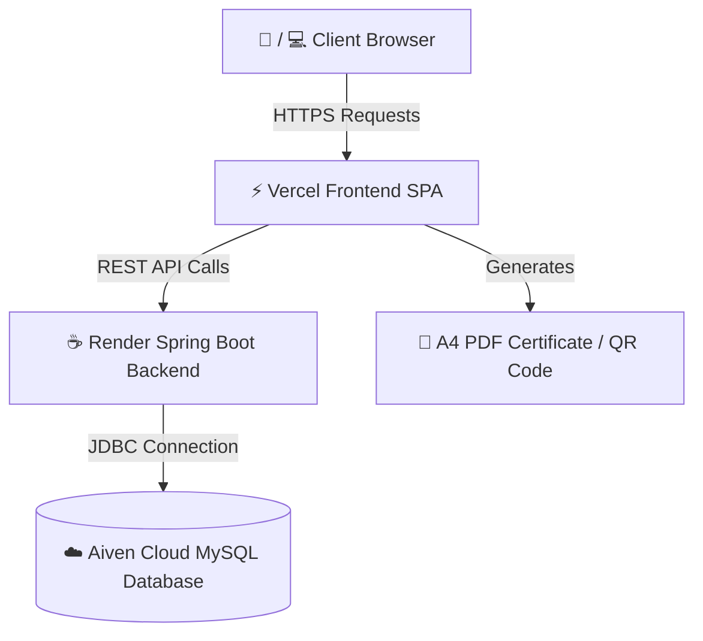

# 🛡️ Uclear — Electronic University Dues Clearance & E-Receipt System

> **Uclear** is a full-stack, cloud-hosted university clearance & dues payment platform engineered for **Federal University of Technology, Akure (FUTA)**. It streamlines student & staff fee settlements, generates cryptographic e-receipt certificates, and provides institutional bursars with audit ledgers and real-time clearance inspection tools.

---

## 📌 Executive Summary & Project Scope

In traditional academic institutions, clearance processing for graduation, examination registration, and staff union fees requires manual paper receipts, physical bursary stamps, and long queue verification. 

**Uclear** solves this by providing:
1. 🎓 **Student & Staff Self-Service Clearance Portal**: Instant online payment and clearance status tracking for all departmental, faculty, SUG, and union dues.
2. 📄 **Cryptographic E-Receipt & PDF Certificates**: Digitally signed, A4 printable certificates with cryptographic hash seals and embedded verification QR codes.
3. 🌐 **1-Click Public Verification**: Anyone (employers, bursary officers, faculty deans) can scan the QR code or visit a public verification link to verify receipt authenticity in real-time.
4. 🏛️ **Multi-Jurisdiction Admin Portal**: Dedicated, secure admin console scoped by administration role (SUG Admin, Faculty Admin, Departmental Admin, University Bursar).
5. 🔍 **Student & Staff Clearance Inspector**: 1-click inspection modal allowing bursars to view paid, pending, and overdue dues for any enrolled user.

---

## 🚀 Live Cloud Architecture & Deployment

Uclear is **100% cloud-hosted** with zero local dependencies:



- 🌐 **Frontend URL**: [https://uclear.vercel.app](https://uclear.vercel.app)
- 🔒 **Admin Portal Route**: [https://uclear.vercel.app/admin](https://uclear.vercel.app/admin)
- ⚙️ **Backend API (Render)**: `https://uclear-backend.onrender.com/api`
- 🗄️ **Database (Aiven Cloud MySQL)**: `mysql-21c02a9c-uclear12.h.aivencloud.com:28557` (`defaultdb`)

---

## 🛠️ Technology Stack & Tools Used

### Frontend Stack (Web Portal)
- **Core Framework**: React 18 (Vite build system)
- **Styling**: Vanilla CSS + Tailwind CSS (Light-mode UI, micro-animations, glassmorphism)
- **Icons**: Lucide Icons React
- **PDF Generation**: `jsPDF` + `html2canvas` (Dynamic canvas rendering)
- **QR Verification**: Server-side QR encoding (`api.qrserver.com`)
- **Deployment Platform**: Vercel (with `vercel.json` SPA rewrite rules)

### Backend Stack (REST API Service)
- **Language & Framework**: Java 17, Spring Boot 3
- **Security & Auth**: Spring Security 6, JWT (JSON Web Tokens), BCrypt Password Hashing
- **Persistence**: Hibernate ORM, Spring Data JPA
- **Database**: Cloud MySQL (Aiven MySQL 8.4)
- **Build & Packaging**: Maven, Multi-stage Docker image
- **Deployment Platform**: Render.com

---

## 🔑 Test User Credentials

All accounts share the default password: **`password123`**

### 🎓 Student Accounts
- **Matric ID**: `SEN/22/9292` (OLA-SALAWU OLAWALE OLUWASEGUN - 300L Software Engineering)
- **Matric ID**: `EEE/21/3321` (Chukwuemeka Nwosu - 400L Electrical Engineering)
- **Matric ID**: `CSC/23/6001` (Afolabi Taiwo Adeyemi - 200L Computer Science)

### 👨‍🏫 Staff Accounts
- **Staff ID**: `FUTA/STF/CS/1092` (PROF S.O SALAWU - Computer Science)
- **Staff ID**: `FUTA/STF/EE/0881` (Dr. Aminu Garba - Electrical Engineering)

### 🏛️ Executive Admin Accounts (Access via [/admin](https://uclear.vercel.app/admin))
- **SUG Executive Admin**: `sug.admin@futa.edu.ng` (Scope: Student Union Dues)
- **Faculty of Computing Admin**: `computing.admin@futa.edu.ng` (Scope: Faculty Levies)
- **Software Eng. Dept Admin**: `sen.admin@futa.edu.ng` (Scope: Departmental Dues)
- **University Bursar Admin**: `bursar.admin@futa.edu.ng` (Scope: All Institutional Dues)

---

## 🎯 Code Location Guide & Feature Implementation Highlights

Below are the exact file paths and code line pointers for the core features implemented in this project:

### 1. 📄 1-Click A4 PDF Certificate Export
- **File**: [`src/components/ReceiptModal.jsx`](file:///C:/Users/dell/.gemini/antigravity-ide/scratch/e-dues-payment-system/src/components/ReceiptModal.jsx#L251-L294) (Lines 251-294)
- **Syntaxes & Logic**: Dynamically imports `jspdf` and `html2canvas`, converts the rendered receipt HTML node into a high-density canvas (`scale: 2`), calculates A4 millimeter aspect ratios (`pdf.addImage`), and triggers browser file download.

### 2. 🖨️ Clean Popup Window Receipt Printing
- **File**: [`src/components/ReceiptModal.jsx`](file:///C:/Users/dell/.gemini/antigravity-ide/scratch/e-dues-payment-system/src/components/ReceiptModal.jsx#L226-L245) (Lines 226-245)
- **Syntaxes & Logic**: Builds a self-contained HTML document via `buildReceiptHtml()` (Lines 8-207), opens a popup window (`window.open`), writes CSS `@page { size: A4 portrait; }`, waits for QR images to load, and invokes `printWin.print()`.

### 3. 📱 Embedded QR Code Generation & Cryptographic Hash
- **File**: [`src/components/ReceiptModal.jsx`](file:///C:/Users/dell/.gemini/antigravity-ide/scratch/e-dues-payment-system/src/components/ReceiptModal.jsx#L215-L220) (Lines 215-220 & Line 296)
- **Syntaxes & Logic**: Computes a unique SHA hash stamp (`SHA-EDUES-...`), constructs a verification URL (`?receipt=TX_REF`), and fetches the QR image asynchronously via `api.qrserver.com`.

### 4. 🌐 1-Click Public Verification System
- **File**: [`src/App.jsx`](file:///C:/Users/dell/.gemini/antigravity-ide/scratch/e-dues-payment-system/src/App.jsx#L91-L219) (Lines 91-219)
- **Syntaxes & Logic**: Detects `URLSearchParams` for `?receipt=`, queries the Spring Boot API `/api/receipts/public/{txRef}`, and renders a public verification banner without requiring user login.

### 5. 🔍 Student & Staff Clearance Standing Inspector Modal
- **File**: [`src/components/AdminPortal.jsx`](file:///C:/Users/dell/.gemini/antigravity-ide/scratch/e-dues-payment-system/src/components/AdminPortal.jsx#L918-L1075) (Lines 918-1075)
- **Syntaxes & Logic**: Takes a selected student or staff profile (`inspectUser`), cross-references all assigned dues against paid receipts, computes exact counts for **Paid (Cleared)**, **Unpaid (Pending)**, and **Overdue** dues, and provides interactive tab filters.

### 6. 🏛️ Admin Role Jurisdiction Scoping & Profile Filtering
- **File**: [`src/components/AdminPortal.jsx`](file:///C:/Users/dell/.gemini/antigravity-ide/scratch/e-dues-payment-system/src/components/AdminPortal.jsx#L314-L330) (Lines 314-330)
- **Syntaxes & Logic**: Evaluates logged-in admin credentials via `getAdminScope(user)`, sets payment scope jurisdiction badges, and filters out all `ADMIN` profiles from the Institutional Registry list so only paying students and staff are shown.

### 7. 🔒 Dedicated `/admin` URL Route & Vercel SPA Configuration
- **File**: [`src/App.jsx`](file:///C:/Users/dell/.gemini/antigravity-ide/scratch/e-dues-payment-system/src/App.jsx#L97-L101) (Lines 97-101 & Lines 484-548)
- **File**: [`vercel.json`](file:///C:/Users/dell/.gemini/antigravity-ide/scratch/e-dues-payment-system/vercel.json#L1-L5) (Lines 1-5)
- **Syntaxes & Logic**: `App.jsx` listens for `window.location.pathname.startsWith('/admin')` to render a dedicated, standalone Admin Login Portal. `vercel.json` adds `rewrites: [{ "source": "/(.*)", "destination": "/index.html" }]` so Vercel forwards client paths to React without 404 errors.

### 8. 🔑 Spring Boot JWT Security & Global CORS Configuration
- **File**: [`SecurityConfig.java`](file:///C:/Users/dell/.gemini/antigravity-ide/scratch/uclear-backend/src/main/java/ng/edu/futa/uclear/security/SecurityConfig.java#L37-L71) (Lines 37-71)
- **File**: [`AuthController.java`](file:///C:/Users/dell/.gemini/antigravity-ide/scratch/uclear-backend/src/main/java/ng/edu/futa/uclear/controller/AuthController.java#L27-L77) (Lines 27-77)
- **Syntaxes & Logic**: Configures Spring Security `SecurityFilterChain`, sets `setAllowedOriginPatterns(List.of("*"))` to allow Vercel web requests, and authenticates student matric numbers, staff IDs, or admin emails against BCrypt hashed passwords.

### 9. 🌱 Automatic Cloud MySQL Database Seeding
- **File**: [`DatabaseSeeder.java`](file:///C:/Users/dell/.gemini/antigravity-ide/scratch/uclear-backend/src/main/java/ng/edu/futa/uclear/config/DatabaseSeeder.java#L35-L48) (Lines 35-48)
- **File**: [`AdminController.java`](file:///C:/Users/dell/.gemini/antigravity-ide/scratch/uclear-backend/src/main/java/ng/edu/futa/uclear/controller/AdminController.java#L34-L57) (Lines 34-57)
- **Syntaxes & Logic**: Implements Spring Boot `CommandLineRunner` and `seedAllIfMissing()`, populating 20 Students, 20 Staff, 4 Admins, and 10 Dues whenever table counts are zero.

---

## 💻 Local Installation & Setup Guide

### 1. Clone Repositories
```bash
# Clone Frontend Repository
git clone https://github.com/Wale2007/uclear-frontend.git
cd uclear-frontend

# Clone Backend Repository
git clone https://github.com/Wale2007/uclear-backend.git
```

### 2. Run Frontend Locally
```bash
cd uclear-frontend
npm install
npm run dev
# App will start at http://localhost:5173
```

### 3. Run Backend Locally
```bash
cd uclear-backend
mvn clean spring-boot:run
# Backend API will start at http://localhost:8080/api
```

---

## 📜 License & Copyright

Designed and developed for **Federal University of Technology, Akure (FUTA)**.  
&copy; 2026 Uclear Payment & Clearance System. All rights reserved.
